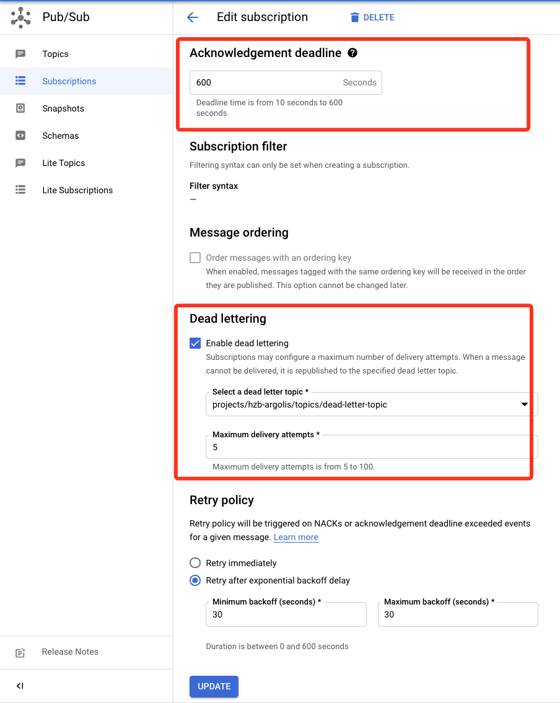

# Auto Translate and add caption to video on Google Cloud (Serverless) 
# 利用谷歌云为视频添加翻译字幕(无服务器)

## Summary
This tool generates translated caption for your uploaded video with only once deploy, and optional hard encoding caption into video.  
此应用只需部署一次，就可随时为你上传的视频生成你指定翻译语言的字幕文件，并可选自动硬编码入视频  
* Auto extract audio track from Video, auto detect the sample rate and channels count.  
从视频自动提取音轨，自动检测音频采样率和声道数量  
* Transcribe audio into text caption with Google Cloud Speech-to-Text API Service, and add caption time stamp.  
利用谷歌云 Speech-to-Text API将音频转译成文本，并加入字幕时间戳  
* Translate source text into target language with Google Cloud Translation API Service.  
利用谷歌云 Translation API将文本翻译为指定语言  
* Transform text back to caption file format.  
转换文本为字幕格式  
* Hard merging caption into video. This step is optional to choose.  
把字幕硬编码进视频中   
* This solution is base on Serverless - Google Cloud Run, no need to worry about setting up, scale or cost of server  
无服务器方案，使用 Google Cloud Run，免去设置服务器和扩展的麻烦  
3分钟的视频，综合成本大约$0.18美金，包括  
Speech API 每个月60分钟免费，3分钟=$0.108
Translate API 每个月前50万字符免费，3000字符=$0.06
Cloud Run 每个月前50分钟免费，运行5分钟 ~$0.007575

## Guide
### You can do below command in Cloud Shell or your own PC with gcloud command
0. Pre-request:
You need to enable Speech API, Cloud Run API, Translate API, Pubsub API, Eventarc API, if you haven't done it yet.  
```
gcloud services enable \
    speech.googleapis.com \
    translate.googleapis.com \
    run.googleapis.com \
    pubsub.googleapis.com \
    eventarc.googleapis.com
```

1. Download code and deploy to Cloud Run service
```
git clone https://github.com/hawkey999/trans_video_subs
cd trans_video_subs/Serverless
gcloud run deploy <CLOUD-RUN-NAME> --source . \
    --concurrency=1 \
    --memory=1024Mi \
    --ingress=internal \
    --timeout=600 \
    --no-allow-unauthenticated \
    --service-account=<SERVICE-ACCOUNT@PROJECT.iam.gserviceaccount.com> \
    --set-env-vars=video_src_language_code=en-US \
    --set-env-vars=translate_src_code=en \
    --set-env-vars=translate_des_code=zh \
    --set-env-vars=merge_sub_to_video=False \
    --set-env-vars=two_step_convert=False
```
This command will auto build a container and deploy to Cloud Run. Remember to replace the CLOUD-RUN-NAME and SERVICE-ACCOUNT@PROJECT.iam.gserviceaccount.com with your own.  You can tune the memory and timeout according to your video size.  
Here are the environment variables descriptions:  
    - **video_src_language**: Video language code. Refer to [Speech-to-Text API language code document](https://cloud.google.com/speech-to-text/docs/languages)  
    - **translate_src_language/translate_des_language**: Translate from translate_src_language to translate_des_language. Refer to [Translate API language code document](https://cloud.google.com/translate/docs/languages)    
    - **merge_sub_to_video**:  True means automatically hard encode the srt caption into Video, as well as output the srt caption file. False means only output the srt caption file.  


2. Create a GCS Bucket for upload videos, please choose a single region bucket.  
```
gsutil mb -l us-central1 gs://<MY-BUCKET-NAME>
```

3. Create Eventarc from GCS Bucket trigger to Cloud Run.   
Notice: While you deploy eventarc triggers, if it reports ERROR similar to this:  
service-xxxxxxxxxx@gs-project-accounts.iam.gserviceaccount.com has no permission to publish messages to pubsub topic  
Then you need to go to Console IAM and add permission for this specific account with pubsub publish.    
```
gcloud eventarc triggers create <TRIGGER-NAME> \
    --location=us-central1 \
    --destination-run-service=<CLOUD-RUN-NAME> \
    --destination-run-region=us-central1 \
    --event-filters="type=google.cloud.storage.object.v1.finalized" \
    --event-filters="bucket=<MY-BUCKET-NAME>" \
    --service-account=<SERVICE-ACCOUNT@PROJECT.iam.gserviceaccount.com>
```

4. Change default setting of the Pubsub of this Eventarc. Go to Console -> Pubsub Subscriptions and find the Eventarc subscription of Pubsub, Edit it.  
**Change the Acknowledgement deadline** from default 10s to 10mins. After this timeout without return message from Cloud Run, Pubsub will resend the messages which will create duplicated jobs.  
Recommand to create a Dead Letter Topic and deliver the dead letter after max retries.  
  

When you are debugging, if there is some retry message you want to delete, you can purge message in this Console.  

5. Upload video to Cloud Storage, the bucket gs://MY-BUCKET-NAME you just created.  
After some minutes, you can download the srt caption file from the ouput bucket gs://MY-BUCKET-NAME-out.  
Or if you set the merge_sub_to_video to True in Cloud Run environment variable, the you can download the video mp4 with encoded caption.  

## Notice: 
* This Serverless solution can handle short videos elastically. Cloud Run can run up to 60 mins. But if your video processing is longer than 10 mins, then Pub/sub will be timeout for Acknowledgement deadline. So you need to decouple multiple steps of this one Cloud Run service into multiple Cloud Run services and don't wait for API response in your Cloud Run's code. This make this architecture decouple as well as save cost. Like this:   
    GCS trigger ->  
    CloudRun 1 Video to Audio ->  
    Speech API -> GCS trigger ->  
    CloudRun 2 Merge format ->  
    Translate API -> GCS trigger -> 
    CloudRun 3 Merge srt format  -> GCS trigger -> 
    (Optional)CloudRun 4 Encoding srt into video ->
    GCS final result

* Max Cloud Run memory setting is 8GB, if your video is larger than this, choose the Server(VM) branch of this solution. 

